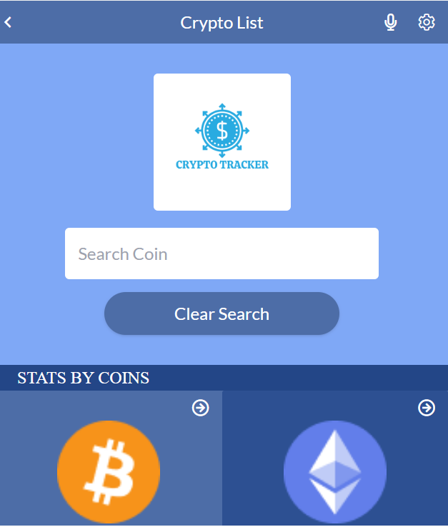
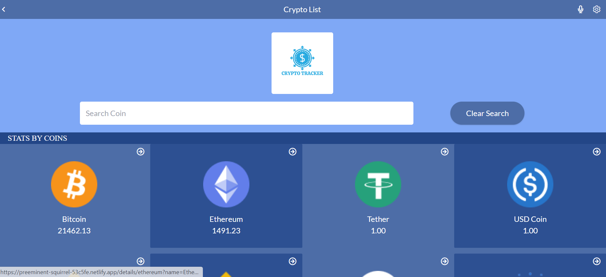
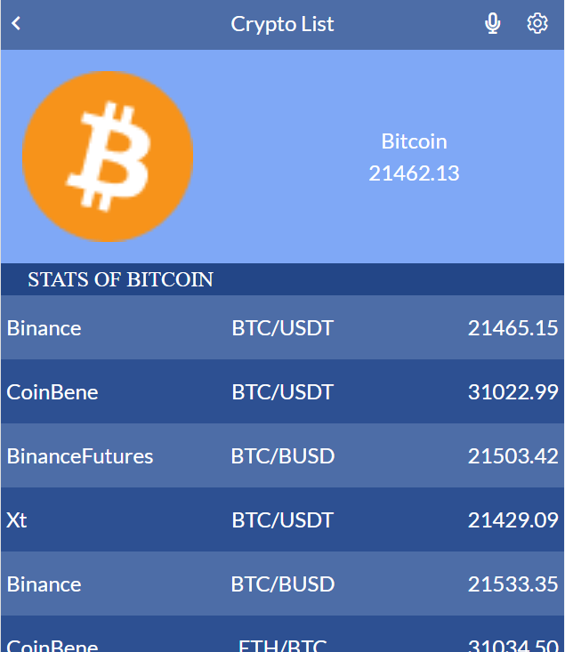
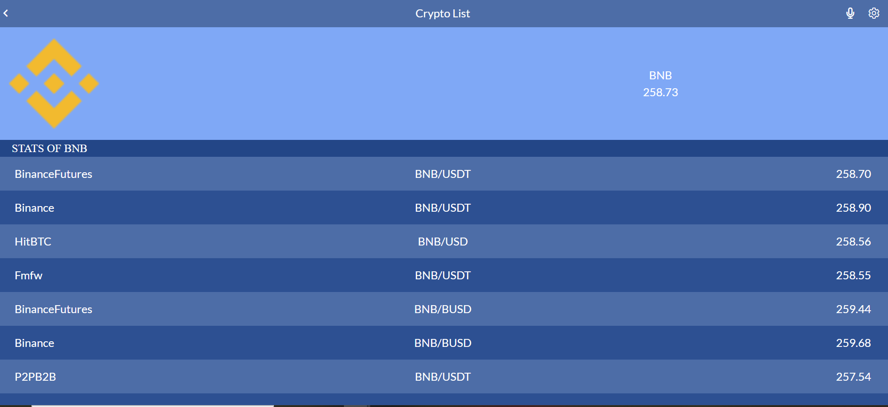

# Crypto Tracker

> This application tracks the major Crypto currencies in the market, and show their details. There is a filter, to check user's desired crypto data.


## Built With

- HTML5
- Tailwind CSS
- React JS
- Redux
- API

## Live Demo (Click To View)

[Live Demo Link](https://preeminent-squirrel-53c5fe.netlify.app/)

>
>
## Project view
 ### Home view 


### Detail view



## Built With

- 
- 
-  
-  
- 
- 
- 
- 

## Video Explanation
- **[Click To view loom video](https://www.loom.com/share/dfb314371e7945ed9caf8252374b1f54)**

## Setup

To get this project up and running, you should do the following;
If you wish to run the project locally, please do the following:

1.- Clone the repository to your local machine.
    - **`git clone https://github.com/RitobrotoMukherjee/crypto-tracker.git`**
    - **`cd crypto-tracker`**

2.- Install Node.js and npm if you haven't already.
   To install Node.js, follow the instructions on [Node.js](https://nodejs.org/en/).
   
   To install npm with the necessary dependencies, run the following command in your terminal:
   ``` bash
   npm install 
   ```

3.- Once you have the setup and the project locally, you can run the project using the following command in your terminal:
``` bash
npm run build
```
4.- and if you want to watch the changes live, run the following command (it will run the website on localhost:3000):
``` bash
npm start
```


## Authors

👤 **Ritobroto Mukherjee**

- Portfolio: [@Rito](https://ritobrotomukherjee.github.io/Work-Portfolio/)
- GitHub: [@RitobrotoMukherjee](https://github.com/RitobrotoMukherjee)
- Twitter: [@RitobrotoM3](https://twitter.com/RitobrotoM3)
- LinkedIn: [Ritobroto Mukherjee](https://www.linkedin.com/in/ritobroto-mukherjee-519148ba/)

## 🤝 Contributing

Contributions, issues, and feature requests are welcome!

Feel free to check the [issues page](https://github.com/RitobrotoMukherjee/crypto-tracker/issues).

## Show your support

Give a ⭐️ if you like this project!

## Acknowledgments

- Design courtesy [Nelson Sakwa](https://www.behance.net/sakwadesignstudio)
- This project was based on the **CoinStats API** 
- Microverse

## 📝 License

This project is [MIT](./MIT.md) licensed.
